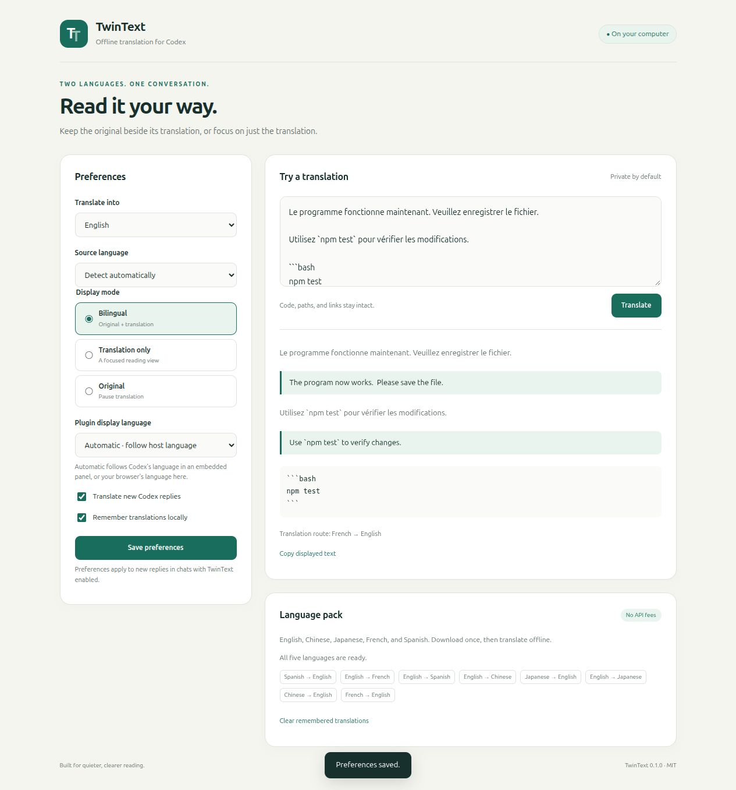

# TwinText for Codex

**Offline bilingual replies for Codex on Linux.** Powered by local Argos Translate models, with no translation API account, subscription, or per-character fee.

Choose **bilingual**, **translation only**, or **original** display. Translation language and plugin interface language are independent settings. English is the default translation target; the interface can follow the host language or use English, Chinese, Japanese, French, or Spanish.

> **What this version does:** formats new Codex replies using a local translation tool and trusted hooks. It does not inject a display overlay into Codex, rewrite previous messages, or translate Codex's native menus. Automatic reply formatting is instruction-driven and depends on Codex following the hook context. Without trusted hooks, invoke the TwinText skill explicitly.



## Languages

| Language | Code | Starter pack |
| --- | --- | --- |
| English | `en` | Default target and pivot language |
| Chinese | `zh` | English ↔ Chinese |
| Japanese | `ja` | English ↔ Japanese |
| French | `fr` | English ↔ French |
| Spanish | `es` | English ↔ Spanish |

The eight models enable all 20 directed pairs between these five languages. Non-English pairs translate through English, which can reduce quality. Chinese uses Argos's `zh` models; this release has no separate Traditional Chinese conversion setting. Automatic source detection runs locally and may be uncertain for very short or mixed-language passages; choose a source language explicitly in that case.

## Install on Linux

Requires Linux x86-64 or aarch64, Python **3.10–3.13**, `venv`, `pip`, and a browser for settings. Python 3.14 is not supported by this release's model dependencies. A GPU is not required. The installer needs internet for Python dependencies and the initial language pack. Allow a few gigabytes of free disk space.

```bash
git clone https://github.com/LincolnGothic/twintext-codex.git
cd twintext-codex
bash scripts/install-linux.sh
```

To select a supported Python interpreter:

```bash
TWINTEXT_PYTHON=/usr/bin/python3.12 bash scripts/install-linux.sh
```

To install the app first and download models later, add `--skip-models`. The script uses a private virtual environment and CPU-only PyTorch dependencies. It merges a TwinText entry into your personal Codex marketplace and preserves unrelated entries. If your home already has a marketplace, TwinText appears under that marketplace's existing name.

After installation:

1. Restart Codex desktop.
2. Open the Plugins Directory, choose your local marketplace, and install/enable **TwinText for Codex**.
3. Review and trust its `SessionStart` and `UserPromptSubmit` hooks when Codex requests trust.
4. Start a new chat and ask **“Open TwinText settings.”** If your host does not render the embedded MCP App, open the standalone settings page with `~/.local/bin/twintext ui --open`.

The embedded UI uses the MCP Apps host locale when available. The standalone page follows the browser's language. Select a plugin display language manually to override either choice. The embedded UI integration is implemented using the MCP Apps bridge; host-specific rendering must be verified in your installed Codex version.

You can also open this repository as a Codex project and use its repo-local `twintext-local` marketplace after installing the runtime. The plugin launcher resolves the installed runtime even when Codex copies the plugin into its cache.

## Use from a terminal

```bash
twintext ui --open
twintext settings --target en --mode bilingual --ui-language auto
twintext settings --target ja --mode translated --ui-language fr
printf '%s\n' 'Bonjour, le programme fonctionne maintenant.' | twintext translate
twintext translate reply.md --source en --target zh --mode bilingual
twintext models list
twintext models install --starter
twintext status
```

If `~/.local/bin` is absent from your `PATH`, use the full path to `~/.local/bin/twintext` or the installed runtime under `${XDG_DATA_HOME:-~/.local/share}/twintext/venv/bin/twintext`.

To use TwinText in a chat without automatic hooks, invoke its skill and ask for translation or bilingual replies. The tools are `twintext_translate`, `twintext_status`, `twintext_set_settings`, `twintext_settings_ui`, `twintext_clear_cache`, and `twintext_install_models`.

## Preservation and privacy

- Translation executes on CPU with installed Argos model tokenizers and CTranslate2. It never calls a cloud translation service or downloads assets during inference.
- Code fences, indented code, inline code, URLs, Markdown links, and recognized file paths are copied verbatim. Tables, link-reference definitions, and display math are conservatively left untranslated.
- Paragraphs are paired in bilingual mode. Code blocks appear once. The preview switches modes immediately; native Codex replies use the saved mode on the next turn.
- Translation cache entries contain translated text and a hash of their original input. The cache stays on this computer and can be disabled or cleared in settings.
- Settings and model files live in `~/.config/twintext` and `~/.local/share/twintext` by default, following XDG directories. `TWINTEXT_HOME` can isolate settings, models, and cache for development.
- The standalone settings server binds only to `127.0.0.1`, validates its host, and requires a per-process token for API requests. It collects no telemetry.
- Translations displayed in a Codex conversation become part of that conversation. The translation engine's offline execution does not change how Codex processes its normal conversation context.

## Development and verification

```bash
python3.12 -m venv .venv
.venv/bin/python -m pip install --index-url https://download.pytorch.org/whl/cpu torch
.venv/bin/python -m pip install -e '.[engine,dev]'
.venv/bin/python -m unittest discover -s tests -v
.venv/bin/ruff check .
node --check src/twintext/web/app.js
```

The fast tests use an injected deterministic model to verify preservation, preferences, caching, MCP errors, and localhost access controls. Real-model checks are separate:

```bash
TWINTEXT_HOME="$PWD/.test-data" .venv/bin/twintext models install --starter
TWINTEXT_HOME="$PWD/.test-data" .venv/bin/python scripts/smoke-models.py
```

The smoke check exercises all 20 language pairs with network access disabled inside the process. It checks nonempty model output and protected-text preservation; it is not a human translation-quality assessment. Models and environment directories are excluded from Git.

See the [release validation notes](docs/validation.md) and [real-model sample results](docs/model-smoke.json).

The project contains a portable plugin manifest plus a Codex compatibility manifest. Distribution is through this repository/local marketplaces; bundled hook plugins are currently outside the public universal plugin directory's supported submission path.

## Remove

Disable or uninstall TwinText in Codex. Remove only the `twintext` entry from your personal marketplace if you no longer need it. You can then remove its dedicated app directory and `~/.local/bin/twintext` symlink. Clear the cache in settings before removal if you want to discard remembered translations. No Codex application files are patched.

## License and references

TwinText is MIT licensed. It is an independent project, with no affiliation with OpenAI or Immersive Translate. Argos Translate is MIT licensed; model assets and transitive dependencies retain their respective licenses. Models are downloaded from the official Argos package index and are not redistributed here.

- [Argos Translate](https://github.com/argosopentech/argos-translate)
- [Codex plugin packaging](https://developers.openai.com/plugins/build/plugins)
- [Codex hooks](https://learn.chatgpt.com/docs/hooks)
- [MCP Apps](https://modelcontextprotocol.io/extensions/apps/overview)
