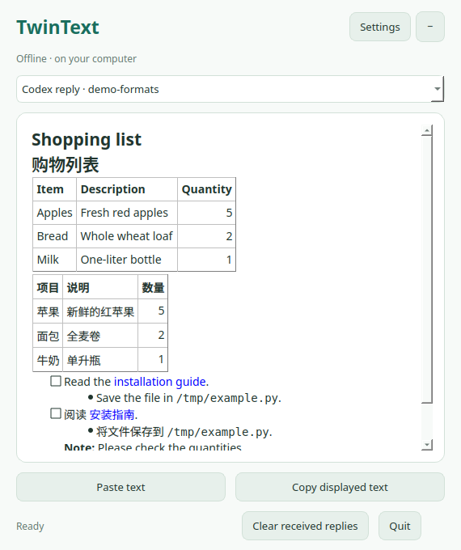

# TwinText for Codex

**Free, open-source offline translation for Windows and Linux.** Choose bilingual,
translation-only or original text in English, Chinese, Japanese, French and Spanish.
Translation language and interface language are independent.

| Style | Where translations appear | Codex token usage |
| --- | --- | --- |
| **TwinText Chat** — the 0.1 experience, repaired | In new final replies inside Codex | Normal tool/context/output overhead; translations enter the conversation |
| **TwinText Desktop** — the 0.2.2 experience | In a separate floating reader | Automatic capture makes no additional LLM requests and adds no translated text to model context |

Both styles use the same current Markdown engine, settings, models and cache.
Select **Translation location** in settings. Desktop is the default; start a new
Codex chat after switching styles to discard old session instructions. Opening
or configuring either style through chat can use ordinary Codex tokens.



**0.3.0 is the first Windows/Linux dual-style public preview.** macOS is not
released. [Release notes](docs/release-0.3.0.md) ·
[Free downloads](https://github.com/LincolnGothic/twintext-codex/releases) ·
[Third-party/model license notices](THIRD_PARTY_NOTICES.md).

## Install or upgrade

Download and extract a Windows or Linux ZIP from Releases. Choose `chat` or
`desktop` for your first-install default; all packages support both. Verify the
ZIP using its matching SHA256SUMS file. These downloads contain **source code
and installers**, not bundled executable apps. They require 64-bit Python
**3.10–3.13** (3.12 recommended), pip and venv. Desktop also needs a graphical
session. Python 3.14 is unsupported by model dependencies.

Setup needs internet and several GB of disk space. It creates a private runtime
with CPU-only PyTorch, Argos and Qt, plus a personal Codex marketplace entry.
There is no translation API key, subscription, license activation or paid service.
Neither a global Python environment nor Codex's application files are modified.

### Linux

From the extracted ZIP folder, or a clone of this repository:

```bash
bash scripts/install-linux.sh
# Optional explicit preferences / model downloads:
bash scripts/install-linux.sh --workflow chat --download-models
```

Select Python explicitly with `TWINTEXT_PYTHON=/usr/bin/python3.12` if needed.
The application menu contains **TwinText Desktop**. CLI: `~/.local/bin/twintext`.
Qt may need distribution libraries; on Ubuntu/Debian:

```bash
sudo apt install libegl1 libopengl0 libxcb-cursor0 libxkbcommon-x11-0
```

### Windows

Install 64-bit Python 3.12 from [python.org](https://www.python.org/downloads/windows/)
with pip and venv. Open PowerShell in the extracted ZIP folder:

```powershell
powershell -NoProfile -ExecutionPolicy Bypass -File .\scripts\install-windows.ps1
# Optional explicit preferences / model downloads:
.\scripts\install-windows.ps1 -Workflow chat -DownloadModels
```

Execution-policy bypass applies only to that process. The installer does not
change machine policy, registry or PATH. Use `-Python 'C:\path\to\python.exe'`
if Python cannot be found. Windows downloads are unsigned.

Open **TwinText Desktop** from Start, or `%LOCALAPPDATA%\TwinText\Open TwinText.cmd`.
For CLI commands use `%LOCALAPPDATA%\TwinText\TwinText.cmd`, for example:

```powershell
& "$env:LOCALAPPDATA\TwinText\TwinText.cmd" ui --open
& "$env:LOCALAPPDATA\TwinText\TwinText.cmd" settings --workflow chat --target zh
```

### Finish setup

1. Install/update **TwinText** from your personal Codex marketplace. Its plugin name
   is `twintext`; a new marketplace is `twintext-linux` or `twintext-windows`.
   Existing marketplace names and unrelated entries are preserved.
2. Restart Codex and review/trust the hooks. Installing a plugin does not grant
   trust. Chat uses **SessionStart** and **UserPromptSubmit**; Desktop uses **Stop**.
   Upgrading from the older adapter adds hooks and may require another review.
3. Choose translation location, target language, display mode and interface language
   in TwinText settings. Start a new Codex chat after switching locations.
4. Existing models are preserved. Models are **not downloaded by default**.
   Open web settings (`twintext ui --open`) and request the language pack, or use
   `--download-models` / `-DownloadModels`. See the model-license notices first.

The shared compatibility manifest makes all three hooks discoverable, repairing
0.1's automatic-mode packaging. The old portable root manifest is removed on
upgrade because the tested Codex loader skipped its hooks. Hook trust remains
under user control. Automatic Chat replies depend on Codex following the tool
instructions; Desktop captures completed replies, not partial streams. Neither
style translates Codex menus or rewrites past messages. Paste works independently.
These local hook plugins are distributed through GitHub/manual installation,
not the OpenAI public plugin directory.

## Translation formats and languages

The shared parser translates table headers/cells, visible link labels, headings,
nested lists, checkboxes, footnote text and quotes. It protects code, paths, email
addresses, numbers, link destinations and math. The original table is followed
by its translated table in bilingual mode; translated-only shows one translated
table. [Format coverage and remaining limits](docs/output-formats.md).

Eight Argos models enable all 20 directions among `en`, `zh`, `ja`, `fr`, `es`.
Non-English pairs pivot through English and may lose quality. Short or mixed-language
source detection can be uncertain; choose the source explicitly when necessary.
Models and dependencies are downloaded from their upstream repositories on request,
not bundled in release assets. Some legacy model-license statements remain unclear;
free pricing does not resolve that. See [the exact audit](THIRD_PARTY_NOTICES.md).

Interface language **Automatic** uses the last Codex locale supplied by the
embedded settings panel, falling back to the system language. Hooks do not supply
Codex's UI locale. Any of the five languages can be selected manually.

```bash
twintext ui --open
twintext desktop --background
twintext settings --workflow chat --target ja --mode translated --ui-language fr
twintext settings --workflow desktop --desktop-auto-start false
twintext models install --starter
twintext clear-cache
```

MCP tools include `twintext_translate`, `twintext_status`, `twintext_set_settings`,
`twintext_settings_ui`, `twintext_open_desktop`, `twintext_install_models` and
`twintext_clear_cache`. The same translator services Chat, Desktop, CLI and previews.

## Floating controls


- **Collapse** reduces the reader to a dark rounded **TwinText ↗** control with a visible six-dot grip. Drag the grip or drag the button to move it; click the button to expand. A dot means a new reply arrived. The grip has a move cursor and a localized tooltip.
- The reader's header can be dragged. Resize with its bottom-right grip. **Keep above other windows** requests always-on-top behavior from the desktop.
- The session selector holds the latest reply from up to 24 chats. A newly completed reply becomes the displayed reply. Old turns are not imported.
- **Receive Codex replies** pauses/resumes capture. **Open floating button on new replies** controls whether the hook starts a closed companion automatically. Uncheck this and launch the app yourself if preferred.
- **Paste text** reads the clipboard only when clicked. You can edit the text before pressing **Translate**; there is no clipboard monitor.
- **Copy displayed text** preserves Markdown. **Clear received replies** removes the local inbox contents. **Settings → Clear cache** removes stored translations independently. **Quit** stops the companion; disable auto-start too if you want it to remain closed on subsequent replies.

On GNOME/Wayland, the compositor controls global placement and may ignore always-on-top hints. This version uses a movable companion, not an overlay that tracks the Codex window. If native Wayland ignores pinning and XWayland is available, launch with `QT_QPA_PLATFORM=xcb twintext desktop`. X11 desktop support depends on its window manager too.

## Local data and preservation

- Inference uses installed Argos tokenizers and CPU CTranslate2. There are no inference-time downloads or cloud translation calls. One background worker keeps the UI responsive and ignores stale results when a newer reply or language selection arrives.
- Code fences, actual indented code, inline code, URLs, reference identifiers, link destinations and recognized file paths remain intact. Table text and visible link labels translate while column separators, alignment and numbers stay intact. Reference definitions, raw HTML blocks, app directives and display math remain unchanged. Protected blocks appear once in bilingual mode.
- Settings live in `~/.config/twintext/settings.json`; models, translation cache, and desktop data live under `~/.local/share/twintext`, respecting XDG directories. On Windows, settings are under `%APPDATA%\TwinText`, and models/cache/inbox/runtime are under `%LOCALAPPDATA%\TwinText`. `TWINTEXT_HOME` isolates these for tests.
- The private desktop inbox stores original reply text locally, even if translation caching is disabled. It is bounded to the latest reply from 24 sessions and can be cleared independently. The translator cache can be disabled or cleared from settings.
- **Retention:** the translation cache is `~/.local/share/twintext/translations.sqlite3`, limited to 10,000 fragments with oldest-used entries evicted as needed. There is no timed expiry. Turning off **Remember translations locally** stops new reads/writes but leaves existing entries; **Clear cache** deletes those entries. The separate inbox is `~/.local/share/twintext/desktop/inbox.sqlite3` and has no timed expiry either: new replies replace the previous reply for that chat, and older sessions are removed above 24. Clearing either store normally completes immediately; SQLite files may remain after their records are cleared. XDG directory overrides and `TWINTEXT_HOME` change these locations.
- The bridge uses a local SQLite inbox and native Windows/Linux file lock, with no network listener. In Chat mode the Stop hook is inactive, preventing double capture. The hook fails open, returns `{}`, and never requests another Codex turn. Multiple app launches activate the existing reader.
- Rendered replies do not fetch Markdown images or open links automatically. There is no telemetry or log of reply text.


## Development and release

```bash
python3.12 -m venv .venv
.venv/bin/python -m pip install -e '.[desktop,dev]'
.venv/bin/python -m unittest discover -s tests -v
.venv/bin/ruff check .
.venv/bin/python scripts/build-release.py --platform linux
.venv/bin/python scripts/build-release.py --platform windows
```

CI runs the regression suite on native Windows and Linux with Python 3.10, 3.12
and 3.13. The release workflow additionally installs from a ZIP, downloads one
English→Chinese model, checks real table translations in both modes, executes
native hook commands, renders Qt, and verifies settings/model preservation.
Only after both operating systems pass does it publish the free preview and
checksums. Standard public GitHub runners are used; short-lived artifacts avoid
paid storage. No macOS jobs or paid signing services are configured.

Read [validation notes](docs/validation.md) and [release limitations](docs/release-0.3.0.md).
Desktop movement, hook trust and automatic Chat tool use still require testing in
actual user sessions; CI does not simulate an entire Codex conversation.

## Remove

Disable/uninstall TwinText in Codex and quit its window. Remove its marketplace
entry and runtime directory, plus the TwinText application-menu/Start shortcut.
On Linux also remove the owned `~/.local/bin/twintext` link. Settings/cache/models
are separate; keep them to retain preferences or remove the documented directories
to delete local records. Do not remove unrelated marketplace entries.

## License

TwinText source is [MIT licensed](LICENSE), independent of OpenAI and Immersive
Translate. Runtime dependencies and language assets retain their own licenses;
see [THIRD_PARTY_NOTICES.md](THIRD_PARTY_NOTICES.md). The releases contain no payment
system and no bundled third-party model weights or runtime binaries.
