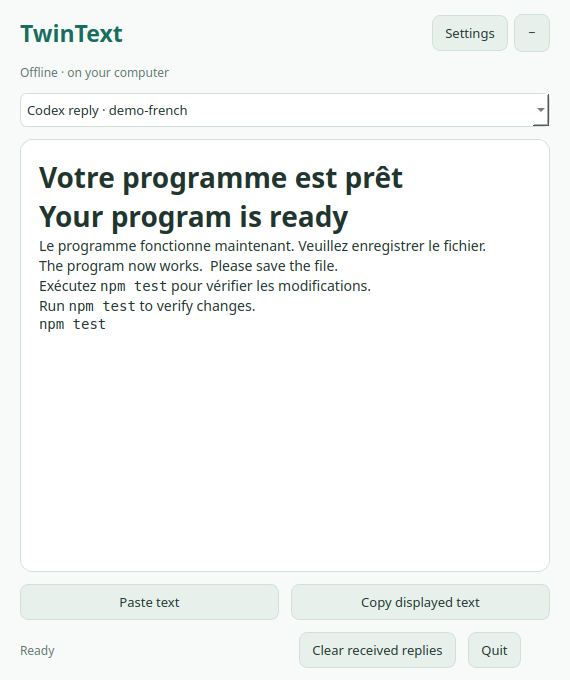

# TwinText Desktop for Codex

**An offline floating translation companion for Codex on Linux.** Read completed replies in two languages, or show only the translation. English, Chinese, Japanese, French, and Spanish are supported, with independent translation and interface language settings.



## How it works

```text
Codex completes its normal reply
          ↓ trusted Stop hook (original text only)
Private local inbox → Argos / CTranslate2 → floating TwinText reader
```

Translations stay in the companion window. The automatic workflow does not ask Codex to call a translation tool, add translations to the conversation, or generate a bilingual final reply. It makes no additional LLM inference requests and adds no translation text to model context. Opening/configuring TwinText through chat, plugin instructions/tool definitions, or explicitly requesting an in-chat translation can still add ordinary Codex token usage. Offline translation itself has no API fee.

This release displays **completed replies**, rather than streaming partial responses. It does not change native Codex message bubbles, translate menus, read other applications, or follow individual paragraphs on screen. The standalone reader also works with text you paste yourself, without Codex or hook approval.

## Install or upgrade on Linux

Requires a graphical Linux session, Python **3.10–3.13**, `venv`, and `pip`. Python 3.14 is not supported by the model dependencies. No GPU, API key, or translation subscription is required. Installation needs internet for dependencies and initial models; allow a few gigabytes of free disk space.

```bash
git clone https://github.com/LincolnGothic/twintext-codex.git
cd twintext-codex
bash scripts/install-linux.sh
```

For an existing clone, run `git pull --ff-only` and the same installer. To select Python explicitly:

```bash
TWINTEXT_PYTHON=/usr/bin/python3.12 bash scripts/install-linux.sh --skip-models
```

`--skip-models` preserves installed models and skips downloads. The installer creates a private virtual environment with CPU-only PyTorch, Argos, and Qt, an app-menu entry named **TwinText Desktop**, and a personal Codex marketplace entry. It preserves unrelated marketplace entries and your saved settings.

Qt may need desktop libraries supplied by your distribution. On Ubuntu/Debian, if startup reports missing libraries:

```bash
sudo apt install libegl1 libopengl0 libxcb-cursor0 libxkbcommon-x11-0
```

After installation or upgrade:

1. Install/update and enable **TwinText Desktop** from your personal Codex marketplace. Its internal plugin name remains `twintext`. From the Codex CLI, use `codex plugin add twintext@twintext-linux`; substitute your existing personal marketplace name if different.
2. Restart Codex and review/trust the plugin's **`Stop` hook**. Installation does not grant hook trust. Version 0.2 replaces the old `SessionStart` / `UserPromptSubmit` instruction hooks; start a new chat to discard old session instructions.
3. Open **TwinText Desktop** from the application menu, or run `~/.local/bin/twintext desktop`.
4. Choose translation language and bilingual/translation-only mode under **Settings**. The defaults are English and bilingual.

Without trusted hooks, the reader waits for replies; **Paste text** still works. No Codex application files are patched.

**Upgrading from 0.2.0:** that release's portable `plugin.json` package was ignored for hook discovery by Codex, even with hooks enabled. Version 0.2.1 uses `.codex-plugin/plugin.json` and `.mcp.json`, and the installer removes TwinText's obsolete root manifests. Reinstall/update the plugin, then open **Codex Settings → Hooks** to review its Stop command. The expected command is `python3 "${PLUGIN_ROOT}/hooks/capture.py"`. If no TwinText hook appears, it has not been discovered; restarting or trusting the project alone cannot fix that. See [the upstream loader](https://github.com/openai/codex/blob/main/codex-rs/core-plugins/src/loader.rs) and [reported issue](https://github.com/openai/codex/issues/47925).

## Floating controls

- **Collapse** reduces the reader to a compact `TT ↔` button. Drag its small handle to move it; click the button to expand. `TT ●` means a new reply arrived.
- The reader's header can be dragged. Resize with its bottom-right grip. **Keep above other windows** requests always-on-top behavior from the desktop.
- The session selector holds the latest reply from up to 24 chats. A newly completed reply becomes the displayed reply. Old turns are not imported.
- **Receive Codex replies** pauses/resumes capture. **Open floating button on new replies** controls whether the hook starts a closed companion automatically. Uncheck this and launch the app yourself if preferred.
- **Paste text** reads the clipboard only when clicked. You can edit the text before pressing **Translate**; there is no clipboard monitor.
- **Copy displayed text** preserves Markdown. **Clear received replies** removes the local inbox contents. **Quit** stops the companion; disable auto-start too if you want it to remain closed on subsequent replies.

On GNOME/Wayland, the compositor controls global placement and may ignore always-on-top hints. This version uses a movable companion, not an overlay that tracks the Codex window. If native Wayland ignores pinning and XWayland is available, launch with `QT_QPA_PLATFORM=xcb twintext desktop`. X11 desktop support depends on its window manager too.

## Languages and settings

| Language | Code | Starter models |
| --- | --- | --- |
| English | `en` | Default translation target and pivot |
| Chinese | `zh` | English ↔ Chinese |
| Japanese | `ja` | English ↔ Japanese |
| French | `fr` | English ↔ French |
| Spanish | `es` | English ↔ Spanish |

The eight models enable all 20 directed pairs. Non-English pairs pivot through English and may lose quality. There is no separate Traditional Chinese conversion setting. Local source detection can be uncertain for short or mixed-language replies; choose a source language explicitly when needed.

**Interface language → Automatic** uses the last Codex host locale supplied when you open the embedded TwinText settings panel, falling back to your system language. The hook does not supply Codex's locale. You can select any of the five interface languages manually. Translation language is unaffected.

The embedded/standalone web settings page remains available, including model downloads and cache controls:

```bash
twintext ui --open
twintext desktop --background
twintext settings --target ja --mode translated --ui-language fr
twintext settings --desktop-auto-start false --always-on-top true
twintext models list
twintext models install --starter
twintext status
printf '%s\n' 'Bonjour, le programme fonctionne maintenant.' | twintext translate
```

MCP tools include `twintext_open_desktop`, `twintext_settings_ui`, `twintext_status`, and `twintext_set_settings`. `twintext_translate` remains available for **explicit manual in-chat translation**, which has normal tool/context/output token overhead. The plugin skill no longer instructs Codex to translate each reply.

## Local data and preservation

- Inference uses installed Argos tokenizers and CPU CTranslate2. There are no inference-time downloads or cloud translation calls. One background worker keeps the UI responsive and ignores stale results when a newer reply or language selection arrives.
- Code fences, indented code, inline code, URLs, Markdown links, and recognized file paths remain intact. Tables, link-reference definitions, and display math are conservatively left untranslated. Protected blocks appear once in bilingual mode.
- Settings live in `~/.config/twintext/settings.json`; models, translation cache, and desktop data live under `~/.local/share/twintext`, respecting XDG directories. `TWINTEXT_HOME` isolates these for tests.
- The private desktop inbox stores original reply text locally, even if translation caching is disabled. It is bounded to the latest reply from 24 sessions and can be cleared independently. The translator cache can be disabled or cleared from settings.
- The bridge uses a local SQLite inbox and file lock, with no network listener. The hook fails open, returns `{}`, and never requests another Codex turn. Multiple app launches activate the existing reader.
- Rendered replies do not fetch Markdown images or open links automatically. There is no telemetry or log of reply text.

## Development and validation

```bash
python3.12 -m venv .venv
.venv/bin/python -m pip install --index-url https://download.pytorch.org/whl/cpu torch
.venv/bin/python -m pip install -e '.[engine,desktop,dev]'
.venv/bin/python -m unittest discover -s tests -v
.venv/bin/ruff check .
node --check src/twintext/web/app.js
bash -n scripts/install-linux.sh
python scripts/check-codex-plugin.py --codex /path/to/codex
```

The desktop tests use Qt's offscreen platform and an injected translator. They verify the hook contract, bounded/concurrent capture, stale-result handling, display modes, all interface languages, and unchanged original replies. For a real-model desktop smoke check, first install the starter models, then run:

```bash
.venv/bin/python scripts/smoke-desktop.py /tmp/twintext-desktop.png
.venv/bin/python scripts/smoke-models.py
```

See [validation notes](docs/validation.md) and [model sample results](docs/model-smoke.json). These are functional checks, not a human translation-quality assessment. ARM Linux has not been tested. Automatic delivery inside a specific Codex desktop build must be verified after the user trusts its hook.

## Remove

Disable/uninstall `twintext` in Codex and quit TwinText Desktop. Remove only its marketplace entry, app directory, `~/.local/bin/twintext` symlink, and `~/.local/share/applications/twintext.desktop` entry if desired. Settings are separate under `~/.config/twintext`.

## License and references

MIT licensed; independent of OpenAI and Immersive Translate. Model assets and dependencies retain their own licenses and are downloaded from the official Argos index rather than redistributed here. Qt for Python is a separately licensed dependency; see [its licensing documentation](https://doc.qt.io/qtforpython-6/licenses.html).

- [Argos Translate](https://github.com/argosopentech/argos-translate)
- [Codex hooks](https://learn.chatgpt.com/docs/hooks)
- [Codex plugin packaging](https://developers.openai.com/plugins/build/plugins)
- [MCP Apps](https://modelcontextprotocol.io/extensions/apps/overview)
- [Codex Bilingual Overlay](https://github.com/mgjc22962/codex-bilingual-overlay), a Windows display-only architecture reference; TwinText implements its own Linux companion and hook bridge.
